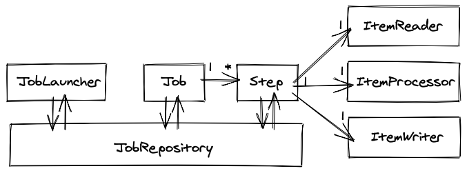

# Spring Batch Simple Getting Started

This project shows the process of creating a basic batch solution.

## Description
### Dependency
- spring-boot-starter-batch
- h2database

### Spring Batch Model


- Job
  - It is an entity that encapsulates an entire batch process
  - It is simply a container for Step instances
  - It combines multiple steps that belong logically together in a flow and allows for configuration of properties global to all steps
- Step
  - It  is a domain object that encapsulates an independent, sequential phase of a batch job
- JobRepository
  - It is the persistence mechanism for all the `Jobs` and `Steps`
- JobLauncher
  - It represents a simple interface for launching a `Job`
- Item Reader
  - It is an abstraction that represents the retrieval of input for a `Step`
- Item Writer
  - It is an abstraction that represents the output of a `Step`
- Item Processor
  - It is an abstraction that represents the business processing of an item

## Demo
### ItemProcessor
Processor Class implements `ItemProcessor` interface

```kotlin
class EmployeeItempProcessor: ItemProcessor<Employee, Employee>
```

### ItemReader
Create ItemReader Bean by FlatFileItemReaderBuilder

```kotlin
@Bean
fun reader(): FlatFileItemReader<Employee> = FlatFileItemReaderBuilder<Employee>()
```

### ItemWriter
Create ItemWriter Bean by JdbcBatchItemWriter

```kotlin
@Bean
fun writer(dataSource: DataSource): JdbcBatchItemWriter<Employee>()
```

### Step
Step involves `Reader`, `Processor` and `Writer`.
```kotlin
@Bean
fun step1(writer: JdbcBatchItemWriter<Employee?>): Step = stepBuilderFactory.get("step1")
            .chunk<Employee, Employee>(10)
            .reader(reader())
            .processor(processor())
            .writer(writer)
            .build()
```
## Features

- feature:1
- feature:2

## Requirement

## Usage

## Installation

## Licence

Released under the [MIT license](https://gist.githubusercontent.com/shinyay/56e54ee4c0e22db8211e05e70a63247e/raw/34c6fdd50d54aa8e23560c296424aeb61599aa71/LICENSE)

## Author

[shinyay](https://github.com/shinyay)
